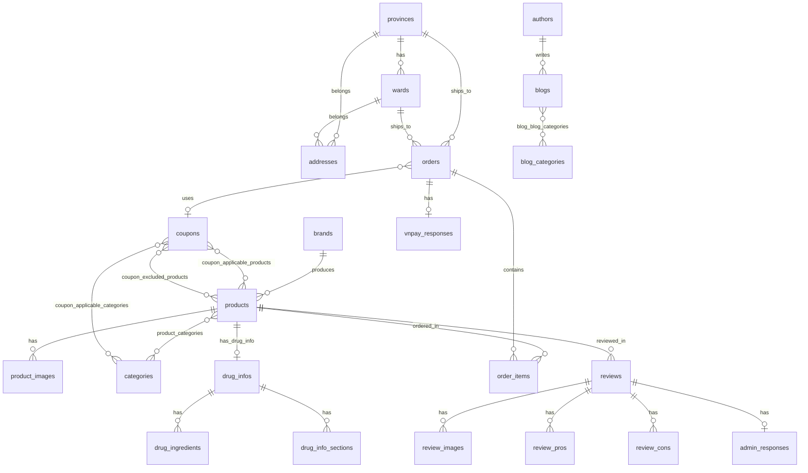

# Database SQL Schema - Khủng Long Châu Web

> Chuyển đổi từ Sanity CMS sang PostgreSQL. Tất cả dữ liệu đều ở dạng bảng quan hệ, không dùng JSONB.

## Quy ước chung

- **PK**: `id UUID PRIMARY KEY DEFAULT gen_random_uuid()`
- **Timestamps**: `created_at TIMESTAMPTZ DEFAULT NOW()`, `updated_at TIMESTAMPTZ DEFAULT NOW()`
- **FK**: `REFERENCES table(id) ON DELETE CASCADE/SET NULL/RESTRICT`
- **Rich Text**: Lưu dạng `TEXT` (HTML). Khi migrate từ Sanity, convert Portable Text → HTML.
- **Hình ảnh**: Lưu URL dạng `TEXT`.

---

## 1. ENUM Types

```sql
CREATE TYPE product_status AS ENUM ('new', 'hot', 'sale');

CREATE TYPE product_variant AS ENUM (
  'thuoc', 'thuc-pham-chuc-nang', 'duoc-my-pham',
  'cham-soc-ca-nhan', 'trang-thiet-bi-y-te',
  'dinh-duong-thuc-pham-chuc-nang', 'sinh-ly'
);

CREATE TYPE discount_type AS ENUM ('percentage', 'fixed_amount', 'free_shipping');
CREATE TYPE payment_method AS ENUM ('cod', 'momo', 'vnpay');

CREATE TYPE order_status AS ENUM (
  'pending', 'processing', 'shipped',
  'out_for_delivery', 'delivered', 'cancelled'
);

CREATE TYPE chat_author AS ENUM ('user', 'agent');
CREATE TYPE popup_frequency AS ENUM ('always', 'daily', 'weekly', 'once');

CREATE TYPE drug_section_type AS ENUM (
  'indications', 'pharmacodynamics', 'pharmacokinetics',
  'how_to_use', 'dosage', 'overdose', 'missed_dose',
  'side_effects', 'contraindications', 'precautions',
  'driving_and_machinery', 'pregnancy', 'breastfeeding',
  'drug_interactions', 'storage'
);
```

---

## 2. Bảng `provinces`

```sql
CREATE TABLE provinces (
  id         UUID PRIMARY KEY DEFAULT gen_random_uuid(),
  name       VARCHAR(100) NOT NULL,
  code       VARCHAR(20)  NOT NULL UNIQUE,
  created_at TIMESTAMPTZ DEFAULT NOW(),
  updated_at TIMESTAMPTZ DEFAULT NOW()
);
```

---

## 3. Bảng `wards`

| FK | Tham chiếu |
|---|---|
| `province_id` | `provinces(id)` |

```sql
CREATE TABLE wards (
  id          UUID PRIMARY KEY DEFAULT gen_random_uuid(),
  name        VARCHAR(100) NOT NULL,
  code        VARCHAR(20)  NOT NULL UNIQUE,
  province_id UUID NOT NULL REFERENCES provinces(id) ON DELETE CASCADE,
  created_at  TIMESTAMPTZ DEFAULT NOW(),
  updated_at  TIMESTAMPTZ DEFAULT NOW()
);
CREATE INDEX idx_wards_province ON wards(province_id);
```

---

## 4. Bảng `categories`

```sql
CREATE TABLE categories (
  id          UUID PRIMARY KEY DEFAULT gen_random_uuid(),
  title       VARCHAR(255) NOT NULL,
  slug        VARCHAR(96)  NOT NULL UNIQUE,
  description TEXT,
  range       INTEGER,
  featured    BOOLEAN DEFAULT FALSE,
  image_url   TEXT,
  created_at  TIMESTAMPTZ DEFAULT NOW(),
  updated_at  TIMESTAMPTZ DEFAULT NOW()
);
```

---

## 5. Bảng `brands`

```sql
CREATE TABLE brands (
  id          UUID PRIMARY KEY DEFAULT gen_random_uuid(),
  title       VARCHAR(255) NOT NULL,
  slug        VARCHAR(96)  NOT NULL UNIQUE,
  description TEXT,
  image_url   TEXT,
  created_at  TIMESTAMPTZ DEFAULT NOW(),
  updated_at  TIMESTAMPTZ DEFAULT NOW()
);
```

---

## 6. Bảng `products`

| FK | Tham chiếu |
|---|---|
| `brand_id` | `brands(id)` |

```sql
CREATE TABLE products (
  id          UUID PRIMARY KEY DEFAULT gen_random_uuid(),
  name        VARCHAR(255) NOT NULL,
  slug        VARCHAR(96)  NOT NULL UNIQUE,
  description TEXT,
  price       DECIMAL(15,2) NOT NULL CHECK (price >= 0),
  discount    DECIMAL(15,2) NOT NULL DEFAULT 0 CHECK (discount >= 0),
  stock       INTEGER DEFAULT 0 CHECK (stock >= 0),
  brand_id    UUID REFERENCES brands(id) ON DELETE SET NULL,
  origin      VARCHAR(255),
  status      product_status,
  variant     product_variant,
  is_featured BOOLEAN DEFAULT FALSE,
  created_at  TIMESTAMPTZ DEFAULT NOW(),
  updated_at  TIMESTAMPTZ DEFAULT NOW()
);
CREATE INDEX idx_products_brand   ON products(brand_id);
CREATE INDEX idx_products_slug    ON products(slug);
CREATE INDEX idx_products_status  ON products(status);
CREATE INDEX idx_products_variant ON products(variant);
```

---

## 7. Bảng `product_images`

| FK | Tham chiếu |
|---|---|
| `product_id` | `products(id)` |

```sql
CREATE TABLE product_images (
  id         UUID PRIMARY KEY DEFAULT gen_random_uuid(),
  product_id UUID NOT NULL REFERENCES products(id) ON DELETE CASCADE,
  image_url  TEXT NOT NULL,
  sort_order INTEGER DEFAULT 0,
  created_at TIMESTAMPTZ DEFAULT NOW()
);
CREATE INDEX idx_product_images_product ON product_images(product_id);
```

---

## 8. Bảng `product_categories` (N-N)

```sql
CREATE TABLE product_categories (
  product_id  UUID NOT NULL REFERENCES products(id) ON DELETE CASCADE,
  category_id UUID NOT NULL REFERENCES categories(id) ON DELETE CASCADE,
  PRIMARY KEY (product_id, category_id)
);
```

---

## 9. Bảng `drug_infos` (Thông tin thuốc - 1:1 với products)

> Mỗi product có tối đa 1 drug_info. Chứa thông tin chung và các tiêu đề nhóm.

| FK | Tham chiếu |
|---|---|
| `product_id` | `products(id)` |

```sql
CREATE TABLE drug_infos (
  id                       UUID PRIMARY KEY DEFAULT gen_random_uuid(),
  product_id               UUID NOT NULL UNIQUE REFERENCES products(id) ON DELETE CASCADE,
  drug_name                VARCHAR(500) NOT NULL,
  composition_subtitle     VARCHAR(255),
  usage_section_title      VARCHAR(500),
  usage_instructions_title VARCHAR(500),
  side_effects_title       VARCHAR(500),
  warnings_main_note_title VARCHAR(500),
  warnings_intro_text      TEXT,
  storage_title            VARCHAR(500),
  created_at               TIMESTAMPTZ DEFAULT NOW(),
  updated_at               TIMESTAMPTZ DEFAULT NOW()
);
CREATE INDEX idx_drug_infos_product ON drug_infos(product_id);
```

---

## 10. Bảng `drug_ingredients` (Thành phần thuốc)

| FK | Tham chiếu |
|---|---|
| `drug_info_id` | `drug_infos(id)` |

```sql
CREATE TABLE drug_ingredients (
  id              UUID PRIMARY KEY DEFAULT gen_random_uuid(),
  drug_info_id    UUID NOT NULL REFERENCES drug_infos(id) ON DELETE CASCADE,
  ingredient_name VARCHAR(500) NOT NULL,
  amount          VARCHAR(255),
  sort_order      INTEGER DEFAULT 0,
  created_at      TIMESTAMPTZ DEFAULT NOW()
);
CREATE INDEX idx_drug_ingredients_info ON drug_ingredients(drug_info_id);
```

---

## 11. Bảng `drug_info_sections` (Các mục nội dung chi tiết của thuốc)

> Mỗi mục có `section_type` để phân biệt (chỉ định, dược lực học, cách dùng, v.v.)
> Một `drug_info` có nhiều sections, mỗi section_type chỉ xuất hiện 1 lần.

| FK | Tham chiếu |
|---|---|
| `drug_info_id` | `drug_infos(id)` |

```sql
CREATE TABLE drug_info_sections (
  id            UUID PRIMARY KEY DEFAULT gen_random_uuid(),
  drug_info_id  UUID NOT NULL REFERENCES drug_infos(id) ON DELETE CASCADE,
  section_type  drug_section_type NOT NULL,
  subtitle      VARCHAR(500),
  content       TEXT,
  created_at    TIMESTAMPTZ DEFAULT NOW(),
  updated_at    TIMESTAMPTZ DEFAULT NOW(),
  UNIQUE (drug_info_id, section_type)
);
CREATE INDEX idx_drug_sections_info ON drug_info_sections(drug_info_id);
```

### Mapping section_type ↔ Sanity field

| `section_type` | Sanity path gốc |
|---|---|
| `indications` | `drugInfo.usageSection.indications` |
| `pharmacodynamics` | `drugInfo.usageSection.pharmacodynamics` |
| `pharmacokinetics` | `drugInfo.usageSection.pharmacokinetics` |
| `how_to_use` | `drugInfo.usageInstructions.howToUse` |
| `dosage` | `drugInfo.usageInstructions.dosage` |
| `overdose` | `drugInfo.overdoseAndMissedDose.overdose` |
| `missed_dose` | `drugInfo.overdoseAndMissedDose.missedDose` |
| `side_effects` | `drugInfo.sideEffects` |
| `contraindications` | `drugInfo.warningsAndPrecautions.contraindications` |
| `precautions` | `drugInfo.warningsAndPrecautions.precautions` |
| `driving_and_machinery` | `drugInfo.warningsAndPrecautions.drivingAndOperatingMachinery` |
| `pregnancy` | `drugInfo.warningsAndPrecautions.pregnancy` |
| `breastfeeding` | `drugInfo.warningsAndPrecautions.breastfeeding` |
| `drug_interactions` | `drugInfo.warningsAndPrecautions.drugInteractions` |
| `storage` | `drugInfo.storage` |

---

## 12. Bảng `authors`

```sql
CREATE TABLE authors (
  id         UUID PRIMARY KEY DEFAULT gen_random_uuid(),
  name       VARCHAR(255),
  slug       VARCHAR(96) UNIQUE,
  image_url  TEXT,
  bio        TEXT,
  created_at TIMESTAMPTZ DEFAULT NOW(),
  updated_at TIMESTAMPTZ DEFAULT NOW()
);
```

---

## 13. Bảng `blog_categories`

```sql
CREATE TABLE blog_categories (
  id          UUID PRIMARY KEY DEFAULT gen_random_uuid(),
  title       VARCHAR(255),
  slug        VARCHAR(96) UNIQUE,
  description TEXT,
  created_at  TIMESTAMPTZ DEFAULT NOW(),
  updated_at  TIMESTAMPTZ DEFAULT NOW()
);
```

---

## 14. Bảng `blogs`

| FK | Tham chiếu |
|---|---|
| `author_id` | `authors(id)` |

```sql
CREATE TABLE blogs (
  id             UUID PRIMARY KEY DEFAULT gen_random_uuid(),
  title          VARCHAR(255),
  slug           VARCHAR(96) UNIQUE,
  author_id      UUID REFERENCES authors(id) ON DELETE SET NULL,
  main_image_url TEXT,
  published_at   TIMESTAMPTZ,
  is_latest      BOOLEAN DEFAULT TRUE,
  body           TEXT,
  created_at     TIMESTAMPTZ DEFAULT NOW(),
  updated_at     TIMESTAMPTZ DEFAULT NOW()
);
CREATE INDEX idx_blogs_author ON blogs(author_id);
```

---

## 15. Bảng `blog_blog_categories` (N-N)

```sql
CREATE TABLE blog_blog_categories (
  blog_id          UUID NOT NULL REFERENCES blogs(id) ON DELETE CASCADE,
  blog_category_id UUID NOT NULL REFERENCES blog_categories(id) ON DELETE CASCADE,
  PRIMARY KEY (blog_id, blog_category_id)
);
```

---

## 16. Bảng `banners`

```sql
CREATE TABLE banners (
  id              UUID PRIMARY KEY DEFAULT gen_random_uuid(),
  title           VARCHAR(100) NOT NULL,
  image_url       TEXT,
  alt             VARCHAR(200) NOT NULL,
  description     TEXT,
  is_active       BOOLEAN DEFAULT TRUE,
  is_popup        BOOLEAN DEFAULT FALSE,
  popup_frequency popup_frequency DEFAULT 'daily',
  created_at      TIMESTAMPTZ DEFAULT NOW(),
  updated_at      TIMESTAMPTZ DEFAULT NOW()
);
```

---

## 17. Bảng `addresses`

| FK | Tham chiếu |
|---|---|
| `province_id` | `provinces(id)` |
| `ward_id` | `wards(id)` |

```sql
CREATE TABLE addresses (
  id             UUID PRIMARY KEY DEFAULT gen_random_uuid(),
  name           VARCHAR(50) NOT NULL,
  email          VARCHAR(255),
  street_address TEXT NOT NULL,
  province_id    UUID NOT NULL REFERENCES provinces(id) ON DELETE RESTRICT,
  ward_id        UUID NOT NULL REFERENCES wards(id) ON DELETE RESTRICT,
  is_default     BOOLEAN DEFAULT FALSE,
  created_at     TIMESTAMPTZ DEFAULT NOW(),
  updated_at     TIMESTAMPTZ DEFAULT NOW()
);
CREATE INDEX idx_addresses_province ON addresses(province_id);
CREATE INDEX idx_addresses_ward     ON addresses(ward_id);
```

---

## 18. Bảng `coupons`

```sql
CREATE TABLE coupons (
  id                  UUID PRIMARY KEY DEFAULT gen_random_uuid(),
  code                VARCHAR(20) NOT NULL UNIQUE,
  name                VARCHAR(255) NOT NULL,
  description         TEXT,
  discount_type       discount_type NOT NULL,
  discount_value      DECIMAL(15,2),
  max_discount_amount DECIMAL(15,2),
  min_order_amount    DECIMAL(15,2) DEFAULT 0 CHECK (min_order_amount >= 0),
  usage_limit         INTEGER CHECK (usage_limit >= 1),
  usage_count         INTEGER DEFAULT 0,
  user_limit          INTEGER CHECK (user_limit >= 1),
  start_date          TIMESTAMPTZ NOT NULL,
  end_date            TIMESTAMPTZ,
  is_active           BOOLEAN DEFAULT TRUE,
  created_at          TIMESTAMPTZ DEFAULT NOW(),
  updated_at          TIMESTAMPTZ DEFAULT NOW()
);
```

---

## 19. Bảng `coupon_applicable_categories` (N-N)

```sql
CREATE TABLE coupon_applicable_categories (
  coupon_id   UUID NOT NULL REFERENCES coupons(id) ON DELETE CASCADE,
  category_id UUID NOT NULL REFERENCES categories(id) ON DELETE CASCADE,
  PRIMARY KEY (coupon_id, category_id)
);
```

## 20. Bảng `coupon_applicable_products` (N-N)

```sql
CREATE TABLE coupon_applicable_products (
  coupon_id  UUID NOT NULL REFERENCES coupons(id) ON DELETE CASCADE,
  product_id UUID NOT NULL REFERENCES products(id) ON DELETE CASCADE,
  PRIMARY KEY (coupon_id, product_id)
);
```

## 21. Bảng `coupon_excluded_products` (N-N)

```sql
CREATE TABLE coupon_excluded_products (
  coupon_id  UUID NOT NULL REFERENCES coupons(id) ON DELETE CASCADE,
  product_id UUID NOT NULL REFERENCES products(id) ON DELETE CASCADE,
  PRIMARY KEY (coupon_id, product_id)
);
```

---

## 22. Bảng `orders`

| FK | Tham chiếu |
|---|---|
| `shipping_province_id` | `provinces(id)` |
| `shipping_ward_id` | `wards(id)` |
| `applied_coupon_id` | `coupons(id)` |

```sql
CREATE TABLE orders (
  id                      UUID PRIMARY KEY DEFAULT gen_random_uuid(),
  order_number            VARCHAR(255) NOT NULL UNIQUE,
  clerk_user_id           VARCHAR(255),
  customer_name           VARCHAR(255) NOT NULL,
  email                   VARCHAR(255) NOT NULL,
  phone                   VARCHAR(20)  NOT NULL,
  order_notes             TEXT,
  -- Địa chỉ giao hàng (inline từ vietnameseAddress)
  shipping_street_address TEXT NOT NULL,
  shipping_province_id    UUID REFERENCES provinces(id) ON DELETE RESTRICT,
  shipping_ward_id        UUID REFERENCES wards(id) ON DELETE RESTRICT,
  -- Giá & thanh toán
  total_price             DECIMAL(15,2) NOT NULL CHECK (total_price >= 0),
  currency                VARCHAR(10) DEFAULT 'VND' NOT NULL,
  amount_discount         DECIMAL(15,2) DEFAULT 0 NOT NULL,
  applied_coupon_id       UUID REFERENCES coupons(id) ON DELETE SET NULL,
  coupon_code             VARCHAR(20),
  shipping_fee            DECIMAL(15,2) DEFAULT 0 CHECK (shipping_fee >= 0),
  estimated_delivery_date TIMESTAMPTZ,
  payment_method          payment_method NOT NULL,
  is_paid                 BOOLEAN DEFAULT FALSE NOT NULL,
  status                  order_status DEFAULT 'pending' NOT NULL,
  order_date              TIMESTAMPTZ NOT NULL,
  created_at              TIMESTAMPTZ DEFAULT NOW(),
  updated_at              TIMESTAMPTZ DEFAULT NOW()
);
CREATE INDEX idx_orders_clerk_user   ON orders(clerk_user_id);
CREATE INDEX idx_orders_status       ON orders(status);
CREATE INDEX idx_orders_order_number ON orders(order_number);
```

---

## 23. Bảng `vnpay_responses` (Dữ liệu phản hồi VNPay)

> Tách từ embedded object `vnpayResponse` trong order.

| FK | Tham chiếu |
|---|---|
| `order_id` | `orders(id)` |

```sql
CREATE TABLE vnpay_responses (
  id                 UUID PRIMARY KEY DEFAULT gen_random_uuid(),
  order_id           UUID NOT NULL UNIQUE REFERENCES orders(id) ON DELETE CASCADE,
  vnp_amount         VARCHAR(50),
  vnp_bank_code      VARCHAR(50),
  vnp_response_code  VARCHAR(50),
  vnp_txn_ref        VARCHAR(100),
  vnp_transaction_no VARCHAR(100),
  vnp_pay_date       VARCHAR(50),
  created_at         TIMESTAMPTZ DEFAULT NOW()
);
CREATE INDEX idx_vnpay_order ON vnpay_responses(order_id);
```

---

## 24. Bảng `order_items`

| FK | Tham chiếu |
|---|---|
| `order_id` | `orders(id)` |
| `product_id` | `products(id)` |

```sql
CREATE TABLE order_items (
  id         UUID PRIMARY KEY DEFAULT gen_random_uuid(),
  order_id   UUID NOT NULL REFERENCES orders(id) ON DELETE CASCADE,
  product_id UUID NOT NULL REFERENCES products(id) ON DELETE RESTRICT,
  quantity   INTEGER NOT NULL CHECK (quantity > 0),
  created_at TIMESTAMPTZ DEFAULT NOW()
);
CREATE INDEX idx_order_items_order   ON order_items(order_id);
CREATE INDEX idx_order_items_product ON order_items(product_id);
```

---

## 25. Bảng `reviews`

| FK | Tham chiếu |
|---|---|
| `product_id` | `products(id)` |

```sql
CREATE TABLE reviews (
  id             UUID PRIMARY KEY DEFAULT gen_random_uuid(),
  product_id     UUID NOT NULL REFERENCES products(id) ON DELETE CASCADE,
  customer_name  VARCHAR(100) NOT NULL,
  customer_email VARCHAR(255) NOT NULL,
  rating         SMALLINT NOT NULL CHECK (rating >= 1 AND rating <= 5),
  title          VARCHAR(200) NOT NULL,
  comment        TEXT NOT NULL,
  verified       BOOLEAN DEFAULT FALSE,
  order_number   VARCHAR(255),
  is_approved    BOOLEAN DEFAULT FALSE,
  is_recommended BOOLEAN,
  helpful_count  INTEGER DEFAULT 0,
  review_date    TIMESTAMPTZ NOT NULL DEFAULT NOW(),
  created_at     TIMESTAMPTZ DEFAULT NOW(),
  updated_at     TIMESTAMPTZ DEFAULT NOW()
);
CREATE INDEX idx_reviews_product  ON reviews(product_id);
CREATE INDEX idx_reviews_approved ON reviews(is_approved);
CREATE INDEX idx_reviews_rating   ON reviews(rating);
```

---

## 26. Bảng `review_pros` (Ưu điểm)

| FK | Tham chiếu |
|---|---|
| `review_id` | `reviews(id)` |

```sql
CREATE TABLE review_pros (
  id         UUID PRIMARY KEY DEFAULT gen_random_uuid(),
  review_id  UUID NOT NULL REFERENCES reviews(id) ON DELETE CASCADE,
  content    TEXT NOT NULL,
  sort_order INTEGER DEFAULT 0
);
CREATE INDEX idx_review_pros_review ON review_pros(review_id);
```

---

## 27. Bảng `review_cons` (Nhược điểm)

| FK | Tham chiếu |
|---|---|
| `review_id` | `reviews(id)` |

```sql
CREATE TABLE review_cons (
  id         UUID PRIMARY KEY DEFAULT gen_random_uuid(),
  review_id  UUID NOT NULL REFERENCES reviews(id) ON DELETE CASCADE,
  content    TEXT NOT NULL,
  sort_order INTEGER DEFAULT 0
);
CREATE INDEX idx_review_cons_review ON review_cons(review_id);
```

---

## 28. Bảng `review_images`

| FK | Tham chiếu |
|---|---|
| `review_id` | `reviews(id)` |

```sql
CREATE TABLE review_images (
  id         UUID PRIMARY KEY DEFAULT gen_random_uuid(),
  review_id  UUID NOT NULL REFERENCES reviews(id) ON DELETE CASCADE,
  image_url  TEXT NOT NULL,
  sort_order INTEGER DEFAULT 0,
  created_at TIMESTAMPTZ DEFAULT NOW()
);
CREATE INDEX idx_review_images_review ON review_images(review_id);
```

---

## 29. Bảng `admin_responses` (Phản hồi admin cho review)

| FK | Tham chiếu |
|---|---|
| `review_id` | `reviews(id)` |

```sql
CREATE TABLE admin_responses (
  id           UUID PRIMARY KEY DEFAULT gen_random_uuid(),
  review_id    UUID NOT NULL UNIQUE REFERENCES reviews(id) ON DELETE CASCADE,
  content      TEXT,
  responded_at TIMESTAMPTZ,
  responded_by VARCHAR(255),
  created_at   TIMESTAMPTZ DEFAULT NOW()
);
CREATE INDEX idx_admin_responses_review ON admin_responses(review_id);
```

---

## 30. Bảng `chat_messages`

```sql
CREATE TABLE chat_messages (
  id           UUID PRIMARY KEY DEFAULT gen_random_uuid(),
  session_id   VARCHAR(255),
  phone_number VARCHAR(20),
  author       chat_author NOT NULL,
  text         TEXT,
  created_at   TIMESTAMPTZ DEFAULT NOW()
);
CREATE INDEX idx_chat_messages_session ON chat_messages(session_id);
```

---

## Sơ đồ quan hệ (ERD)



---

## Tóm tắt mapping Sanity → SQL

| Sanity Schema | SQL Table(s) | Ghi chú |
|---|---|---|
| `product` | `products`, `product_images`, `product_categories` | Ảnh → bảng riêng, categories → bảng N-N |
| `product.drugInfo` | `drug_infos`, `drug_ingredients`, `drug_info_sections` | Tách thành 3 bảng thay vì JSONB |
| `category` | `categories` | 1-1 |
| `brand` | `brands` | 1-1 |
| `order` | `orders`, `order_items`, `vnpay_responses` | products → order_items, vnpayResponse → bảng riêng |
| `order.shippingAddress` | Inline trong `orders` | vietnameseAddress → cột trực tiếp |
| `coupon` | `coupons` + 3 bảng N-N | applicableCategories/Products, excludedProducts |
| `review` | `reviews`, `review_images`, `review_pros`, `review_cons`, `admin_responses` | Mọi nested đều thành bảng |
| `blog` | `blogs`, `blog_blog_categories` | body (rich text) → TEXT |
| `blogcategory` | `blog_categories` | 1-1 |
| `author` | `authors` | bio (rich text) → TEXT |
| `banner` | `banners` | description (rich text) → TEXT |
| `address` | `addresses` | FK tới provinces, wards |
| `province` | `provinces` | Lookup table |
| `ward` | `wards` | FK tới provinces |
| `chatMessage` | `chat_messages` | 1-1 |

---

## Thứ tự tạo bảng (theo dependency)

> Agent cần tạo bảng theo thứ tự này để tránh lỗi FK:

1. ENUM types
2. `provinces`
3. `wards`
4. `categories`
5. `brands`
6. `products`
7. `product_images`
8. `product_categories`
9. `drug_infos`
10. `drug_ingredients`
11. `drug_info_sections`
12. `authors`
13. `blog_categories`
14. `blogs`
15. `blog_blog_categories`
16. `banners`
17. `addresses`
18. `coupons`
19. `coupon_applicable_categories`
20. `coupon_applicable_products`
21. `coupon_excluded_products`
22. `orders`
23. `vnpay_responses`
24. `order_items`
25. `reviews`
26. `review_pros`
27. `review_cons`
28. `review_images`
29. `admin_responses`
30. `chat_messages`

---

## Tổng kết

- **30 bảng** SQL (không có JSONB)
- **8 ENUM types**
- **6 bảng quan hệ N-N**: `product_categories`, `blog_blog_categories`, `coupon_applicable_categories`, `coupon_applicable_products`, `coupon_excluded_products`
- **Tất cả rich text** (Portable Text / blockContent) lưu dạng `TEXT` (HTML)
- **Tất cả nested object** đã được tách thành bảng riêng với FK
